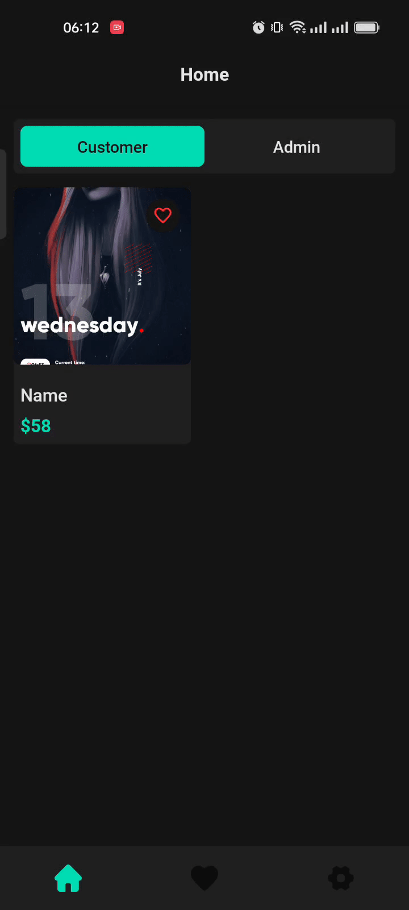
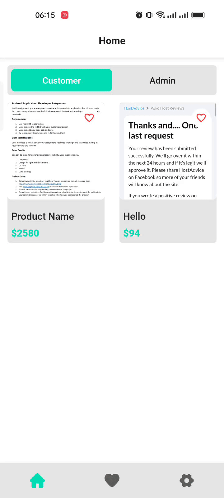
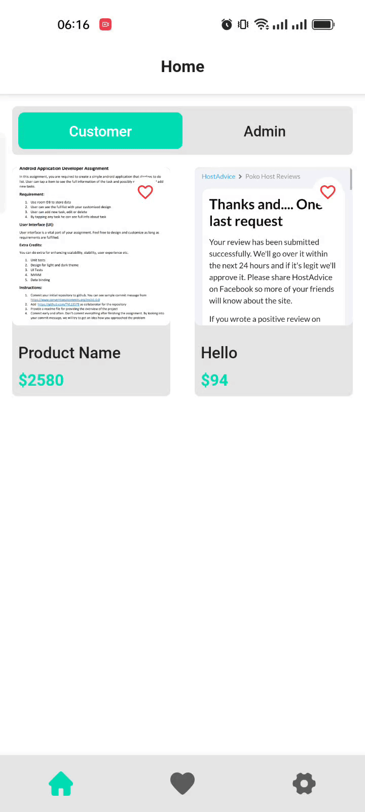
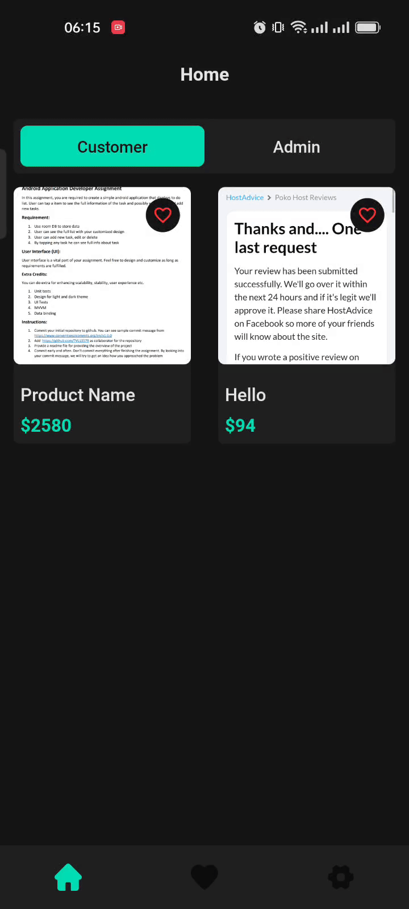

## General

Used Room Database, Data Binding, View Binding and Followed MVVM Architecture Pattern to build the app

<a id="raw-url" href="files/apk/E_Commerce_Demo.apk?raw=true">
</a>

## Specs / Open-source libraries:

- Minimum **SDK 21**, _but AppCompat is used all the way ;-)_
- [**Kotlin**](https://github.com/JetBrains/kotlin) all new modules starting from 2.5.3 will be written in **#Kotlin**.
- [**MVVM**](https://developer.android.com/jetpack/guide) the architecture pattern used in the app (Model-View-ViewModel), that incorporates the Android Architecture Components
- [**ViewModel**](https://developer.android.com/topic/libraries/architecture/viewmodel) for designed to store and manage UI-related data in a lifecycle conscious way.
- [**LiveData**](https://developer.android.com/topic/libraries/architecture/livedata) for observable data
- [**ViewBinding**](https://developer.android.com/topic/libraries/view-binding) for easily interacts with views
- [**DataBinding**](https://developer.android.com/topic/libraries/data-binding) for easily setup views in xml

## Visual Usage Tutorial

|                           Create New Product                         |                            Remove a Product                         |                            Add to Favorite                             |
| :------------------------------------------------------------------: | :-----------------------------------------------------------------: | :------------------------------------------------------------------: |
|   |  |   |

|                           View Product Details                         |                            Change Quantity                         |                            Change App Theme                             |
| :------------------------------------------------------------------: | :-----------------------------------------------------------------: | :------------------------------------------------------------------: |
|   |  |   |

## Manual Usage Tutorial
- Go to admin section and click on add product
- Add a product image and fill the product details (It will be more effecient if you pick a lower size image)
- If you want to delete a product simply click on delete icon
- Click on edit icon to update details of an existing product
- Go to home in customer tab to view products as a customer
- Click on heart icon to add a product to favorite list
- Click hear icon again to remove from favorite
- Go to favorite section to view your favorite products
- Click on a prodcut to view details of it
- You can increase and decrease product quantity
- Go to settings section to change the theme mode

## Third Party Plugins and Dependencies

- Applied this plugin
```
plugins {
    id 'kotlin-kapt'
}
```

- Added these dependencies
```
//Short Intent
implementation "com.saadahmedev.shortintent:shortintent:$shortIntentVersion"

//Tiny DB
implementation "com.saadahmedev.tinydb:tinydb:$tinyDBVersion"

//sSP sDP
implementation "com.intuit.ssp:ssp-android:$spVersion"
implementation "com.intuit.sdp:sdp-android:$spVersion"

//Room Database
implementation "androidx.room:room-ktx:$roomVersion"
kapt "androidx.room:room-compiler:$roomVersion"
implementation "android.arch.persistence.room:runtime:$persistenceRoomVersion"
kapt "android.arch.persistence.room:compiler:$persistenceRoomVersion"

//Rounded image view
implementation "com.makeramen:roundedimageview:$roundedIvVersoin"
```

- Added versions in Project build.gradle file
```
ext {
    shortIntentVersion = '3.0.0'
    tinyDBVersion = '1.0.0'
    spVersion = '1.0.6'

    roomVersion = '2.4.2'
    persistenceRoomVersion = '1.1.1'

    roundedIvVersoin = '2.3.0'
}
```
